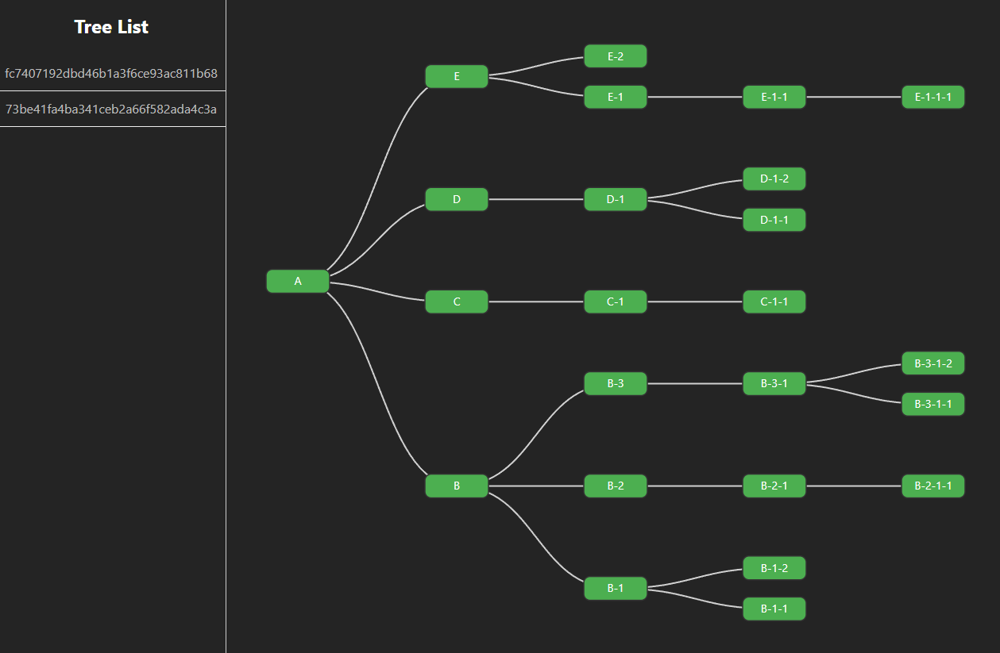

# GraphTreeVisualizer

A graph visualization tool that displays hierarchical data structures using Neo4j and Neomodel.



## Features

- Interactive node visualization with D3.js
- Neo4j graph database integration via Neomodel
  - Graph traversal and querying
  - Relationship modeling
  - Data validation
- Hierarchical tree layout (left-to-right or top-to-bottom)
- Node selection with detailed information display
  - Clicking a node shows its details in a sidebar
  - Node details include name and description
  - Selected node remains highlighted
  - Close button to deselect nodes
- RESTful API for graph data management

## Technology Stack

- **Database:**
    - [**Neo4j**](https://neo4j.com) - graph database
    - [**Neomodel**](https://neomodel.readthedocs.io) - Neo4j Object Graph Mapper
        - Node definitions
        - Property validation
        - Relationship handling
        - Graph queries
- **Backend:**
    - [**FastAPI**](https://fastapi.tiangolo.com) - Python web framework
        - [Pydantic](https://docs.pydantic.dev) - data validation
- **Frontend:**
    - [**Vue.js**](https://vuejs.org) with Vite
        - [D3.js](https://d3js.org) - graph visualization
        - API client
- **Testing:**
    - [Pytest](https://pytest.org)

API documentation: [http://localhost:8000/docs](http://localhost:8000/docs)

## How to Run it!

### Using Docker Compose
```
docker-compose up -d
```
Access the application at [http://localhost:3000](http://localhost:3000).

### Backend Setup

1. First, ensure Neo4j is running and accessible
```bash
# Set the Neo4j connection details in your .env file:
NEO4J_BOLT_URL=bolt://localhost:7687
NEO4J_USERNAME=neo4j
NEO4J_PASSWORD=your_password
```

2. Set up the Python environment
```bash
cd backend
python -m venv .venv
source .venv/bin/activate
pip install -r requirements.txt
```

3. Initialize the database and start the server
```bash
# Run prestart.sh to initialize the Neo4j database and load initial graph data
./prestart.sh 
uvicorn src.main:app --reload
```

### Frontend
```
cd frontend
npm install
npm run dev
```

### Run Tests
```
pytest
```