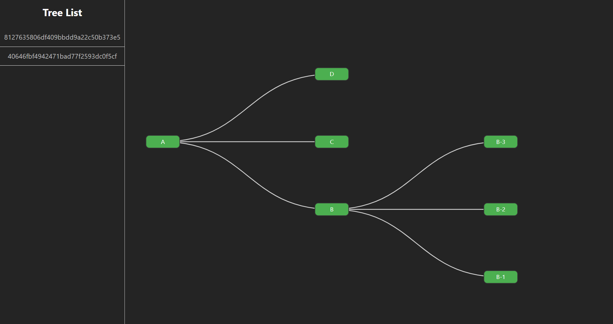

# GraphTreeVisualizer

## Challenge
[Read the challenge details](./challenge.md)

## Technology Stack and Features

- **Backend:**
    - [**FastAPI**](https://fastapi.tiangolo.com) for the Python backend API.
        - [Neomodel](https://neomodel.readthedocs.io) for Neo4j database interactions.
        - [Pydantic](https://docs.pydantic.dev) for data validation and settings management.
        - [Neo4j](https://neo4j.com) as the graph database.
- **Frontend:**
    - [**Vue.js**](https://vuejs.org) with Vite for a modern frontend stack.
        - [D3.js](https://d3js.org) for interactive graph visualization.
- **Testing:**
    - [Pytest](https://pytest.org) for backend testing.

Explore the API documentation at [http://localhost:8000/docs](http://localhost:8000/docs).



## How to Run it!

### Using Docker Compose
```
docker-compose up -d
```
Access the application at [http://localhost:3000](http://localhost:3000).

### Backend

```
createdb <dbname>
# Set the environment variables in the .env file
cd backend
python -m venv .venv
source .venv/bin/activate
pip install -r requirements.txt
# Run ./prestart.sh to initiate the database loading the graph
./prestart.sh 
uvicorn src.main:app --reload
```

### Frontend
```
cd frontend
npm install
npm run dev


